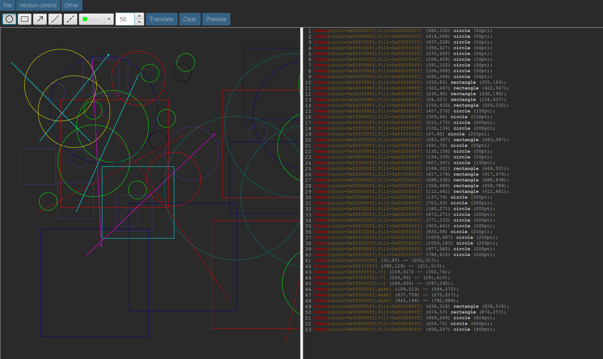
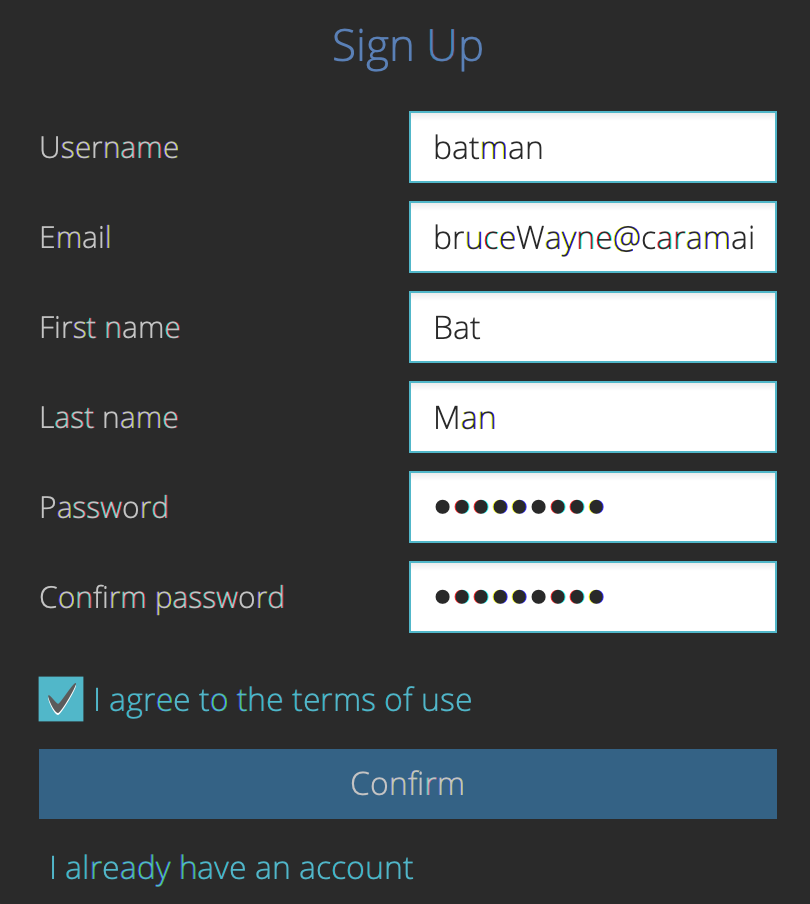
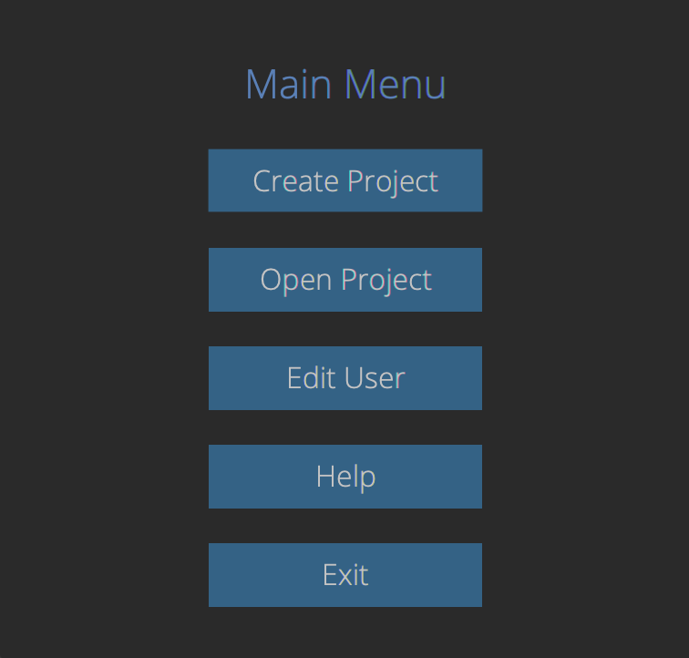
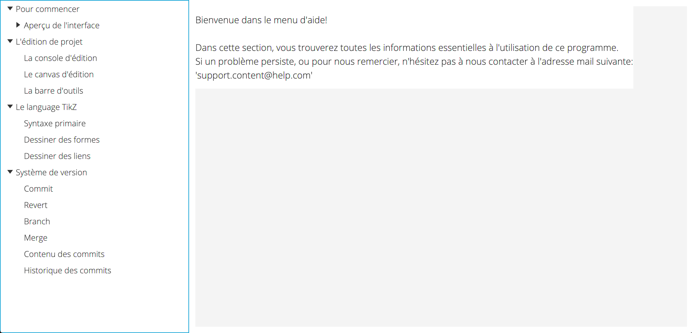

# TikZOverflow : Projet de génie logiciel et gestion de projet (INFO-F-307)

## Introduction

Ce logiciel offre la possibilité de gérer des projects écrits dans le langage TikZ. 
Il permet la gestion de projets, la rédaction de code TikZ, et le dessin de diagrammes afin d'en obtenir le code TikZ correspondant. 
La coloration syntaxique du code facilite l'écriture de la source.



## Utilisation

Un compte utilisateur, qui peut être créé lors de l'ouverture du programme, est nécéssaire pour son utilisation. 



Le menu principal est ensuite présenté.



A tout moment, après l'enregistrement d'un utilisateur, un menu d'aide est accessible depuis la barre de menu.



## Compilation

Le programme est écrit pour être compilé avec la version 1.8 de Java SDK, qui doit donc être installée préalablement. 
Des instructions pour passer sur Java SDK 1.8 se trouvent [ici](./team/switchToSDK8.md). 
Les autres librairies sont fournies dans lib.

## Démarrage

La commande pour lancer le programme est la suivante (à lancer depuis une ligne de commande dans le repertoire du fichier '.jar', situé [ici](./dist):
```bash
java -jar g06-iteration-4.jar
```

# Configuration :

Il est indispensable de disposer de la version 1.8 de Java SDK. 

## Serveur 

Aucune configuration nécessaire

## Client

Aucune configuration nécessaire

# Tests

Les tests sont exécutables depuis IntelliJ et sont codés en JUnit.
