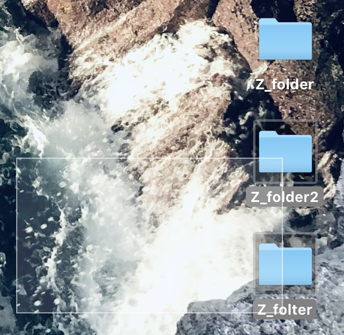

# Politique de sélection d'une portion de schéma
Dans le présent document, nous présentons la politique de sélection d'une portion de diagramme dans le canvas de dessin.
Nous abordons d'abord le moyen qu'a l'utilisateur pour sélectionner une portion de graphique.

Ensuite, nous décrivons la forme de la sélection. Nous choisissons, enfin, la politique d'inclusion d'un élément dans la sélection.
Nous terminons par un exemple concret.

## Interface utilisateur
L'utilisateur peut effectuer un "cliqué-glissé" dont l'endroit de clic et de relâchement correspondent aux deux extrémités de la sélection, après être passé en "Mode Sélection".
Un aperçu de la portion sélectionnée est affichée et délimitée par une ligne tant que le clic n'est pas relâché.

Les éléments sélectionnés sont affichés en surbrillance dès qu'ils sont inclus dans la sélection (cf. Inclusion des éléments graphiques), et le restent tant que le "Mode Sélection" est activé.
### "Mode Sélection"
Le mode sélection désigne l'état du programme permettant à l'utilisateur de sélectionner une portion de graphique.
Pour y accéder, l'utilisateur doit cliquer sur le bouton de sélection dans la barre d'outils.

N'importe quelle action, hormis une nouvelle sélection et un "Copier/Coller", fait sortir le programme de cet état.

## Forme de la sélection
La sélection se fait sous forme de rectangle. 
Les deux sommets opposés sont définis par le clic et le relâchement précédemment mentionnés.
## Inclusion des éléments graphiques
Un élément est considéré comme faisant partie de la sélection dès que l'intersection entre cet élément et la sélection est non-nulle.
Tout élément dont l'intersection avec la sélection est nulle est considéré comme hors de la sélection.

## Exemples
Cette section pourra être mise à jour une fois la sélection implémentée dans le programme.
### Sélection de tous les éléments

### Sélection d'aucun élément

### Sélection d'une partie des élements

## Position de collage
L'ensemble de la sélection est collée de telle sorte que le clic définit le coin supérieur gauche du collage.
Ainsi, tous les calculs de coordonnées se font à partir de ce clic vers le bas et la droite.